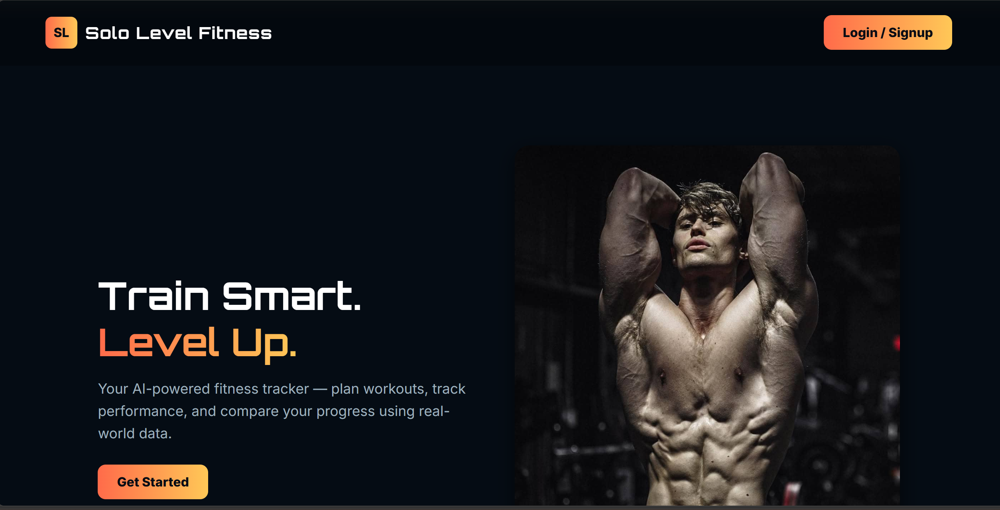
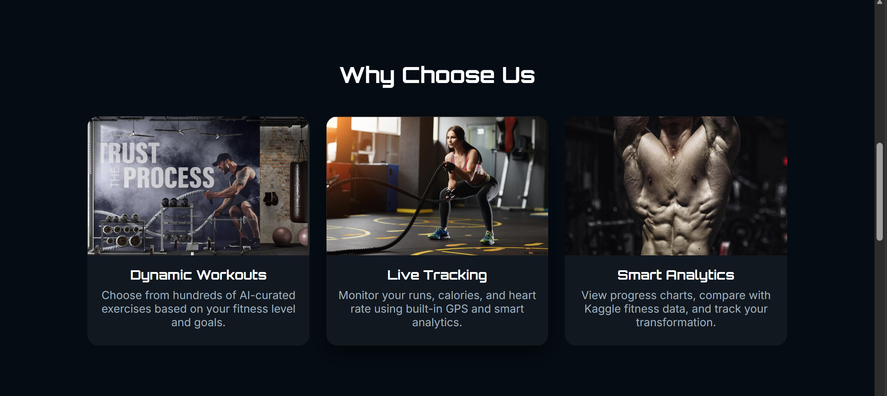
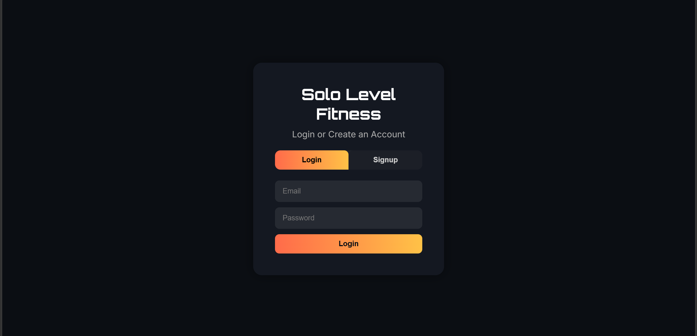
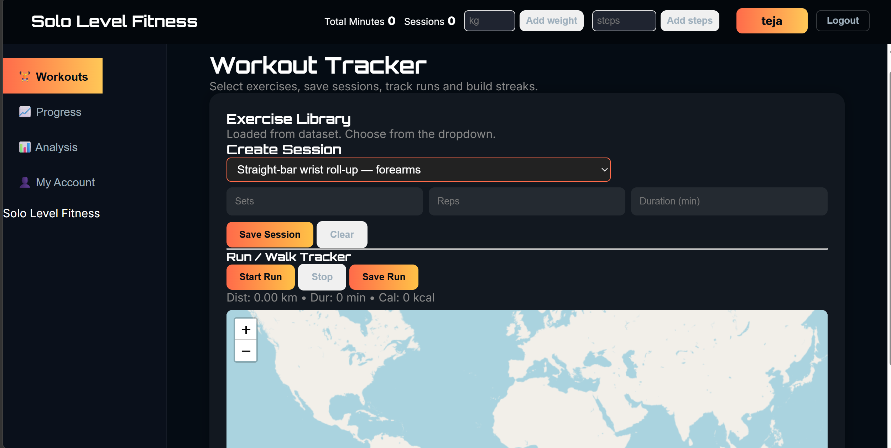
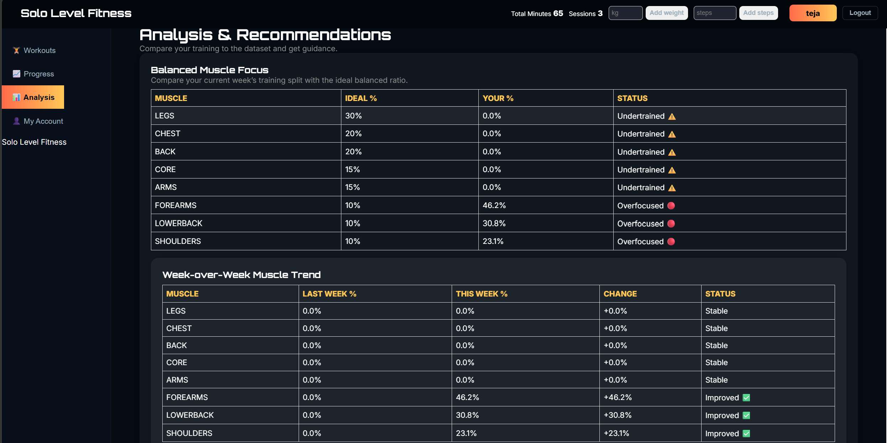

# 🏋️ Solo Level Fitness

> AI-powered fitness tracker web app — plan workouts, track runs with GPS, and analyze muscle balance using real-world Kaggle fitness data.

🌐 **Live Demo:** [sololevelfitness.netlify.app](https://sololevelfitness.netlify.app)

---

## 📸 Screenshots

### Landing Page




### Login / Signup


### Workout Tracker


### Analysis & Recommendations Dashboard


---

## 📌 Project Overview

Solo Level Fitness is a full-stack web application built with HTML, CSS, JavaScript and Firebase. It allows users to log workouts, track runs using GPS, monitor progress and compare their muscle training split against an ideal balanced ratio using a real Kaggle gym exercise dataset.

---

## ✨ Features

**🔐 Authentication**
- Login and Signup with Firebase Authentication
- Per-user data stored and synced with Firebase Firestore

**💪 Workout Tracker**
- Exercise library loaded from Kaggle gym dataset (500+ exercises)
- Select exercise, sets, reps, duration → Save session
- Session history stored per user

**🏃 Run / Walk Tracker**
- Live GPS tracking using browser Geolocation API
- Interactive map powered by Leaflet.js
- Tracks distance (km), duration (min), calories burned
- Save and review past runs

**📊 Progress Dashboard**
- Total minutes trained and sessions completed
- Weight and steps tracking
- Week-over-week progress charts

**🧠 Analysis & Recommendations**
- Balanced Muscle Focus table — compares your training split vs ideal ratio
- Week-over-week muscle trend (Improved / Stable / Undertrained / Overfocused)
- Data-driven recommendations based on Kaggle fitness dataset

---

## 📁 Repository Structure

```
solo-level-fitness/
│
├── index.html                        # Landing page
├── login.html                        # Login / Signup page
├── dashboard.html                    # Main app dashboard
├── app.js                            # Core JS — Firebase, GPS, analytics logic
├── styles.css                        # Global styling
│
├── data/
│   ├── gym exercises dataset.xlsx    # Full gym exercise library (Kaggle)
│   ├── gym_exercise_data.csv         # Exercise data for analysis
│   └── run_or_walk.csv              # Run/walk activity dataset
│
├── assets/                           # Images and media
│
├── landing_page.png                  # Screenshot — landing page
├── landing_pagescroll.png            # Screenshot — landing page scroll
├── login_page.png                    # Screenshot — login page
├── main_page.png                     # Screenshot — workout tracker
└── analysis_dashboard.png           # Screenshot — analysis dashboard
```

---

## 🗄️ Dataset

Exercise and workout data sourced from public Kaggle gym fitness datasets:
- `gym_exercise_data.csv` — 500+ exercises with muscle group classifications
- `run_or_walk.csv` — activity classification data for run/walk tracking
- `gym exercises dataset.xlsx` — full exercise library used in the workout dropdown

---

## 🚀 How to Run Locally

```bash
# Clone the repo
git clone https://github.com/vtejareddy14-crypto/solo-level-fitness.git

# Open index.html in your browser
# No build step needed — pure HTML/CSS/JS
```

Or just visit the live site: [sololevelfitness.netlify.app](https://sololevelfitness.netlify.app)

---

## 🏷️ Tech Stack

`HTML5` `CSS3` `JavaScript` `Firebase Auth` `Firebase Firestore` `Leaflet.js` `GPS Geolocation API` `Kaggle Dataset` `Netlify`

---

## 📄 License

For educational and personal use.
